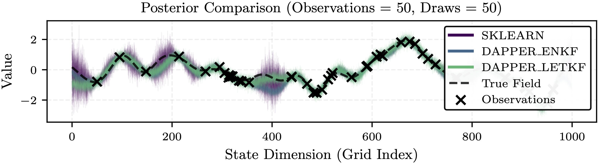
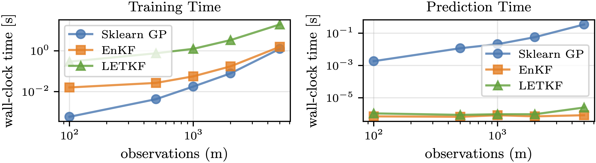
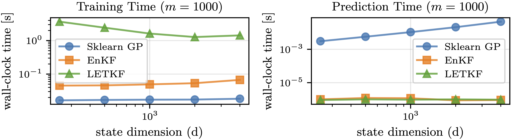

## Ensemble Kálmán = Empirical Matheron

$$
\newcommand{\Normal}{\mathcal{N}}
\newcommand{\rv}[1]{\mathsf{#1}}
\newcommand{\mm}[1]{\mathrm{#1}}
\newcommand{\E}{\mathbb{E}}
\newcommand{\Var}{\mathrm{Var}}
\newcommand{\Cov}{\mathrm{Cov}}
\newcommand{\disteq}{\stackrel{\mathrm{d}}{=}}
$$

**Unifying:**

- Gaussian conditioning
- Kálmán analysis step
- Ensemble Kálmán analysis

::: {.notes}
EnKF is a workhorse in geoscience for data assimilation; Matheron / pathwise GP sampling is popular in ML and geostatistics. The core claim is that the EnKF analysis step is just an empirical Matheron update.
This connection is simple, but not made explicitly, so let's state it.

Think of this presentation as a light sorbet.
You should leave with a refreshing, simple taste in your mouth.
:::

## Gaussian conditioning à la Matheron

Joint Gaussian:

$$
\begin{bmatrix} \rv{x} \\ \rv{y} \end{bmatrix}
\sim
\Normal\!\left(
\begin{bmatrix} m_{\rv{x}} \\ m_{\rv{y}} \end{bmatrix},
\begin{bmatrix}
\mm{C}_{\rv{xx}} & \mm{C}_{\rv{xy}} \\
\mm{C}_{\rv{yx}} & \mm{C}_{\rv{yy}}
\end{bmatrix}
\right).
$$

Matheron / pathwise update:

$$
\rv{x} \mid (\rv{y} = y^*)
\;\disteq\;
\rv{x} + \mm{C}_{\rv{xy}} \mm{C}_{\rv{yy}}^{-1}(y^* - \rv{y}).
$$

[@Doucet2010Note;@Wilson2021Pathwise]

::: {.notes}
Recall Gaussian conditioning.

Top: joint Gaussian prior for `x` and `y` with mean blocks and covariance blocks.

Bottom: the Matheron update gives a *sample-wise* recipe for drawing from the conditional. Start from a prior draw `(x, y)`, then add an affine residual proportional to `y* - y`.

No need to form the conditional covariance explicitly; instead we apply this linear map to prior samples.
:::

## Kálmán update

Gaussian, with linear observation model:

$$
\rv{y} = \mm{H} \rv{x} + \rv{\varepsilon},
\qquad
\rv{\varepsilon} \sim \Normal(0, \mm{R}).
$$

Joint prior:

$$
\begin{bmatrix} \rv{x} \\ \rv{y} \end{bmatrix}
\sim
\Normal\!\left(
\begin{bmatrix} m_{\rv{x}} \\ \mm{H} m_{\rv{x}} \end{bmatrix},
\begin{bmatrix}
\mm{C}_{\rv{xx}} & \mm{C}_{\rv{xx}} \mm{H}^\top \\
\mm{H} \mm{C}_{\rv{xx}} & \mm{H} \mm{C}_{\rv{xx}} \mm{H}^\top + \mm{R}
\end{bmatrix}
\right).
$$

[@Kalman1960New]

::: {.notes}
Classic Kálmán-filter setting, but we only care about the analysis (update) step.

State `x` has prior `N(m_x, C_xx)`. Observations are linear in `x` plus Gaussian noise with covariance `R`.

We now have a joint Gaussian over `(x, y)` ready for conditioning.
:::

## Kálmán update as conditional Gaussian

Posterior mean and covariance:

$$
m_{\rv{x}\mid \rv{y}}
= m_{\rv{x}} + \mm{K} \bigl( y^* - \mm{H} m_{\rv{x}} \bigr),
$$

$$
\mm{C}_{\rv{x}\mid \rv{y}}
= \mm{C}_{\rv{xx}} - \mm{K} \mm{H} \mm{C}_{\rv{xx}},
$$

with Kálmán gain

$$
\mm{K}
= \mm{C}_{\rv{xx}} \mm{H}^\top
  \bigl( \mm{H} \mm{C}_{\rv{xx}} \mm{H}^\top + \mm{R} \bigr)^{-1}.
$$

::: {.notes}
Standard Kálmán posterior updated ("analysis") step.

`K` maps the innovation `y* - H m_x` into a state update. The posterior covariance shrinks by `K H C_xx`.

Conceptually this is the same Gaussian conditioning problem as the Matheron update, but expressed via means and covariances rather than explicit samples.
:::

## Ensemble representation

$$
\begin{aligned}
\mm{X} &= \bigl[ x^{(1)} \;\; x^{(2)} \;\; \dots \;\; x^{(N)} \bigr]\\
\bar{x} &= \frac{1}{N} \sum_{i=1}^N x^{(i)},
\\
\widetilde{\mm{X}} &= \frac{1}{\sqrt{N-1}}
\bigl( \mm{X} - \bar x \mathbf{1}^\top \bigr)\\
\Rightarrow \widehat{\mm{C}}_{\rv{xx}} &= \widetilde{\mm{X}} \widetilde{\mm{X}}^\top + \xi^2 \mm{I} \approx \Var[{\rv{x}}]
\end{aligned}
$$

@Evensen1994Sequential

::: {.notes}
EnKF replaces exact moments by empirical ones from a finite ensemble.

`X` is a `d × N` matrix of prior samples. `X'` are anomalies (demeaned and scaled). `X' X'^T` estimates the prior covariance `C_xx`.

A small ridge `ξ^2 I` is often added for numerical stability / regularisation.
:::

## Ensemble joint and empirical gain

$$
\begin{aligned}
\mm{Y} &= \mm{H} \mm{X},
\qquad
&\widetilde{\mm{Y}} &= \frac{1}{\sqrt{N-1}}
\bigl( \mm{Y} - \bar y \mathbf{1}^\top \bigr) \\
\widehat{\mm{C}}_{\rv{xy}} &= \widetilde{\mm{X}} \widetilde{\mm{Y}}^\top,
\qquad
&\widehat{\mm{C}}_{\rv{yy}} &= \widetilde{\mm{Y}} \widetilde{\mm{Y}}^\top + \gamma^2 \mm{I}.
\end{aligned}
$$

Ensemble Kálmán gain:

$$
\widehat{\mm{K}}
= \widehat{\mm{C}}_{\rv{xy}} \,\widehat{\mm{C}}_{\rv{yy}}^{-1}
= \widetilde{\mm{X}} \widetilde{\mm{Y}}^\top
  \bigl( \widetilde{\mm{Y}} \widetilde{\mm{Y}}^\top + \gamma^2 \mm{I} \bigr)^{-1}.
$$

::: {.notes}
Push the ensemble through `H` to get the observation ensemble `Y`, then form anomalies `Y'`.

`Ĉ_xy` and `Ĉ_yy` are the empirical cross- and auto-covariances (with `γ² I` capturing both sampling regularisation and observation noise).

Plugging them into the Kálmán gain formula gives the ensemble Kálmán gain `K̂`.
:::

## Ensemble Kálmán posterior update

Replicate the observation in columns:

$$
\mm{Y}^* = y^* \mathbf{1}^\top.
$$

Ensemble posterior update:

$$
\begin{aligned}
\mm{X}^{\text{a}}
&= \mm{X} + \widehat{\mm{K}} \bigl( \mm{Y}^* - \mm{H} \mm{X} \bigr)\\
x^{(i)}_{\text{a}}
&= x^{(i)} + \widehat{\mm{K}} \bigl( y^* - \mm{H} x^{(i)} \bigr).
\end{aligned}
$$

::: {.notes}
Core EnKF analysis formula.

For each ensemble member compute its innovation and map it back into state space with `K̂`.

The updated ensemble `{x_a^(i)}` is intended to approximate draws from the true posterior `p(x | y = y*)`.
:::

## Empirical Matheron = EnKF

$$
x \mid (y = y^*)
\;\disteq\;
x + C_{xy} C_{yy}^{-1}(y^* - y).
$$

$$
\mm{C}_{\rv{xy}} \;\to\; \widehat{\mm{C}}_{\rv{xy}},
\qquad
\mm{C}_{\rv{yy}} \;\to\; \widehat{\mm{C}}_{\rv{yy}},
$$

Then each analysis member satisfies

$$
x^{(i)}_{\text{a}}
\;\disteq\;
x^{(i)} +
\widehat{\mm{C}}_{\rv{xy}} \widehat{\mm{C}}_{\rv{yy}}^{-1}
\bigl( y^* - y^{(i)} \bigr),
$$

which is exactly the EnKF update.

::: {.notes}
Main result in one slide.

Take the Matheron rule and plug in empirical covariance estimates. View `(x, y)` as ensemble columns. The sample-wise Matheron update is the EnKF analysis step applied to each member.

In words: **“The EnKF analysis is an empirical Matheron update.”**
:::

## Computational complexity

Exact GP / Kálmán:

- Fit (Cholesky on $m \times m$ matrix):
  $\mathcal{O}(m^3)$.
- Predict at $d$ points with variance:
  $\mathcal{O}(m^2 d)$

Ensemble Kálmán (fixed ensemble size $N$):

- Fit / analysis:
  $\mathcal{O}(N^2 m + N^3)$.
- Predict / read-out of mean:
  $\mathcal{O}(N d)$.

::: {.notes}
Exact GP / Kálmán: cubic in `m` for training, at least quadratic in `m` for full predictive variance.

EnKF trades exactness for an ensemble of size `N`, typically much smaller than `m` and `d`, giving much cheaper analysis and prediction.

Localisation (LETKF) makes the update local in physical space, leading to effectively linear scaling in the state dimension `d`.
:::

## 1D kriging experiment

Prior GP on a grid of size $d$:

$$
x \sim \Normal(0, \mm{K}),
\qquad
\mm{K}_{ij}
= \sigma^2 \exp\!\left(
  - \frac{\lVert r_i - r_j \rVert^2}{2 \ell^2}
\right).
$$

Noisy point observations at $m = d/5$ locations:

$$
\rv{y} = \mm{H} \rv{x} + \rv{\eta},
\qquad
\rv{\eta} \sim \Normal(0, \tau^2 \mm{I}).
$$

## 1D kriging experiment

We compare:

- exact GP regression (scikit-learn),
- EnKF,
- LETKF (localised EnKF).

::: {.notes}
Simple 1D kriging demo from the paper/repo.

`x` is a latent field with squared-exponential GP prior; `m = d/5` noisy point observations with variance `τ²`.

Three solvers:

1. Exact GP regression via `GaussianProcessRegressor`.
2. EnKF using DAPPER.
3. Localised Ensemble Transform Kálmán Filter (LETKF).

Code is in `da_gp/src` and the plotting scripts under `da_gp/scripts`.:contentReference[oaicite:0]{index=0}
:::

## Posterior samples

{width=90%}

::: {.notes}
Posterior mean and samples for all three methods.

Exact GP is the reference. EnKF and LETKF track the mean well, with slightly different posterior spreads (often a bit overconfident).

The important part is that ensemble-based methods produce qualitatively similar posteriors using the empirical Matheron/EnKF update.
:::

## Timing vs observations and dimension

{width=90%}

{width=90%}

::: {.notes}
Top: times vs number of observations `m` at fixed `d`.

- Exact GP shows ~`O(m³)` training behaviour.
- EnKF / LETKF grow much more gently.

Bottom: times vs state dimension `d` at fixed `m`.

- GP prediction cost grows with `d` because of dense covariance operations.
- EnKF / LETKF prediction is essentially linear in `d` (especially with localisation).

These curves illustrate why EnKF-style methods are attractive for large-scale GP regression.
:::

## Capabilities unlocked

- Linear-time / local GP sample paths via EnKF / LETKF.
- Streaming / online hyperparameter learning by state augmentation.
- Differentiable EnKF / Matheron blocks inside bigger ML models.
- Localisation ≈ sparse / local GP structure in space or on graphs.
- Ensemble inversion theory ⇒ error bounds for pathwise GP sampling.

::: {.notes}
Short summary of the “capabilities” section.

The equivalence is not just aesthetic; it lets us port:

- localisation, inflation, smoother variants,
- ensemble inversion algorithms and their convergence results,

into GP modelling, and bring sparse / variational GP ideas back into data assimilation.
:::

## Summary

- Matheron update = sample-wise Gaussian conditioning.
- EnKF analysis = same affine residual map with empirical covariances.
- Therefore: **Ensemble Kálmán update is an empirical Matheron update.**
- This bridges:
  - kriging / geostatistics,
  - ensemble data assimilation (EnKF, LETKF),
  - GP regression and pathwise sampling.

::: {.notes}
Wrap-up.

Single affine residual identity unifies a lot of algorithms across communities. Once we see EnKF as an empirical Matheron update, tools and tricks can flow freely between data assimilation, geostatistics, and GP-based machine learning.
:::

## References